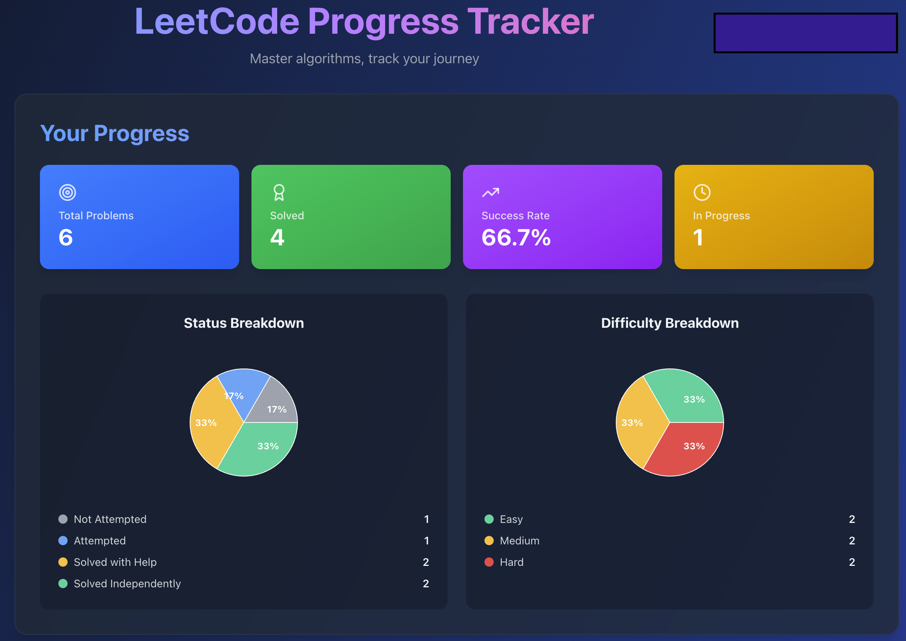
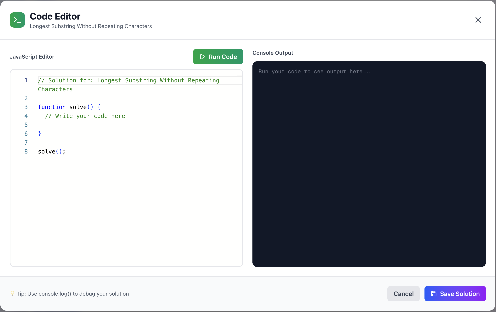
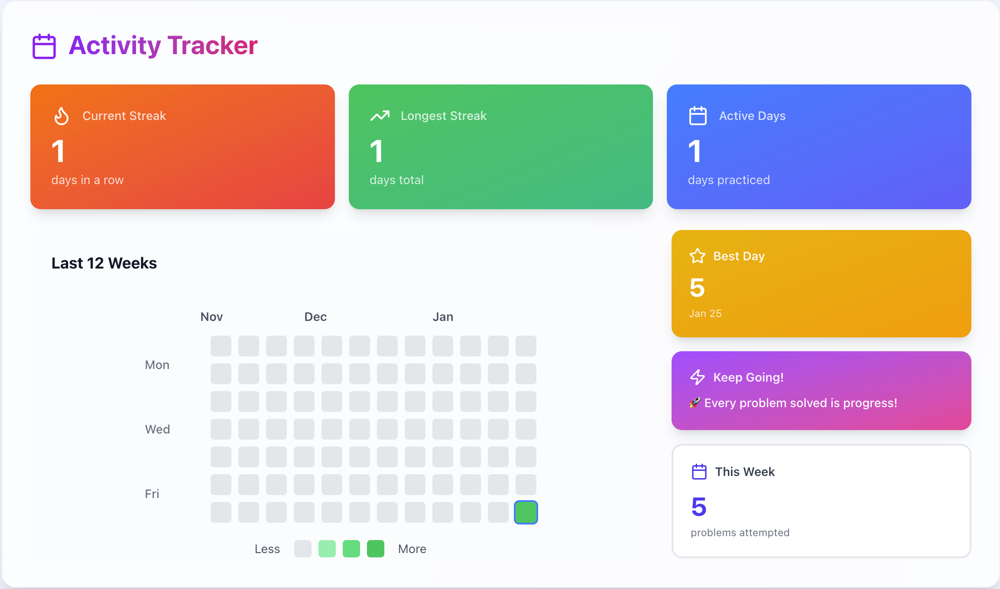
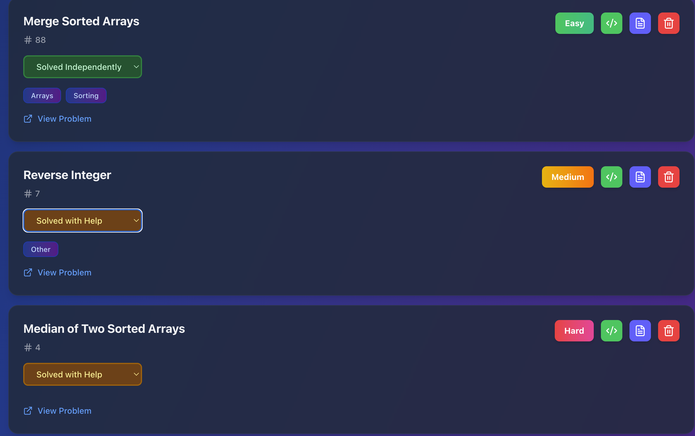
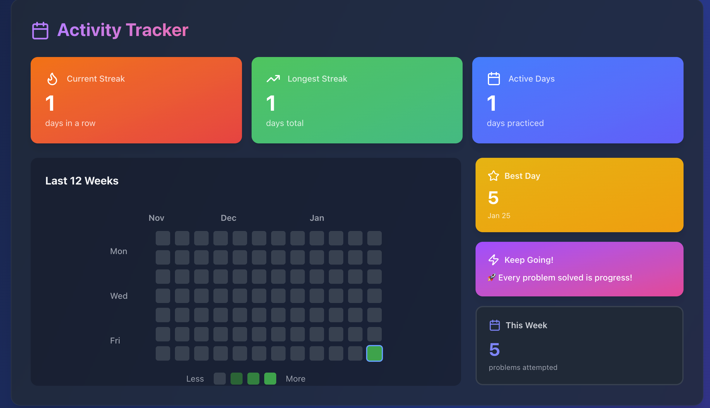

# 🚀 LeetCode Progress Tracker

A modern, full-featured web application for tracking your LeetCode problem-solving journey. Built with cutting-edge technologies and designed for developers who want to master algorithms systematically.

## 📸 Preview

<div align="center">
  
  <p><i>Track your progress with visual statistics and interactive charts</i></p>
</div>

<div align="center">
  
  <p><i>Practice solutions with integrated Monaco Editor and real-time console output</i></p>
</div>

<div align="center">
  
  <p><i>GitHub-style contribution graph showing your coding consistency and streaks</i></p>
</div>

<details>
<summary>📱 See More Screenshots</summary>

<div align="center">
  
  <p><i>Organized problem list with tags, status indicators, and quick actions</i></p>
</div>

<div align="center">
  
  <p><i>Seamless dark mode for comfortable late-night coding sessions</i></p>
</div>

</details>

<p align="center">
  
  
  
  
</p>

---

## ✨ Features

### 📊 **Comprehensive Progress Tracking**
- Visual dashboard with interactive charts showing problem distribution
- Track problems by difficulty (Easy, Medium, Hard)
- Monitor completion status across multiple categories
- Real-time statistics and success rate calculations

### 🔥 **Activity & Streak Tracking**
- GitHub-style contribution graph showing 12 weeks of activity
- Current streak counter with fire emoji motivation 🔥
- Longest streak tracking to beat your personal best
- "Best Day" highlighting your most productive session
- Weekly progress summary and motivational messages

### 💻 **Integrated Code Editor**
- Full-featured Monaco Editor (VS Code's editor)
- Write and test JavaScript solutions directly in-app
- Real-time console output with error handling
- Save solutions to Firebase for future reference
- Syntax highlighting and auto-completion

### 📝 **Rich Note-Taking System**
- Add detailed notes for each problem
- Document your thought process and approach
- Store algorithm explanations and edge cases
- Markdown-style formatting support
- Quick preview on problem cards

### 🎨 **Modern UI/UX**
- Beautiful gradient backgrounds and glass morphism effects
- Smooth animations and micro-interactions
- Dark mode support with system preference detection
- Fully responsive design (mobile, tablet, desktop)
- Toast notifications for user feedback

### 🔐 **Secure Authentication**
- Firebase Authentication with email/password
- User-specific data isolation
- Secure session management
- Easy account management dropdown

### 🏷️ **Smart Organization**
- Filter problems by difficulty and status
- Tag problems by algorithm type (Arrays, Trees, DP, etc.)
- Search and sort capabilities
- Color-coded difficulty badges
- Status indicators with visual feedback

---

## 🛠️ Tech Stack

### **Frontend**
- **[Next.js 15](https://nextjs.org/)** - React framework with App Router
- **[React 18](https://react.dev/)** - UI library with hooks
- **[TypeScript](https://www.typescriptlang.org/)** - Type-safe JavaScript
- **[Tailwind CSS v4](https://tailwindcss.com/)** - Utility-first CSS framework
- **[Monaco Editor](https://microsoft.github.io/monaco-editor/)** - VS Code's editor for web
- **[Recharts](https://recharts.org/)** - Composable charting library
- **[Lucide React](https://lucide.dev/)** - Beautiful icon library

### **State Management**
- **[Redux Toolkit](https://redux-toolkit.js.org/)** - Official Redux toolset
- **React Context API** - Theme and authentication management

### **Backend & Database**
- **[Firebase Authentication](https://firebase.google.com/products/auth)** - User authentication
- **[Cloud Firestore](https://firebase.google.com/products/firestore)** - NoSQL database
- **Firebase SDK** - Real-time data synchronization

### **Development Tools**
- **ESLint** - Code linting
- **PostCSS** - CSS processing
- **Git** - Version control

---

## 📦 Installation

### Prerequisites
- Node.js 18+ installed
- npm or yarn package manager
- Firebase account (free tier works)

### Setup Steps

1. **Clone the repository**
```bash
git clone https://github.com/yourusername/leetcode-tracker.git
cd leetcode-tracker
```

2. **Install dependencies**
```bash
npm install
```

3. **Set up Firebase**
- Create a new Firebase project at [firebase.google.com](https://firebase.google.com)
- Enable Authentication (Email/Password)
- Create a Firestore database
- Get your Firebase configuration

4. **Configure environment variables**

Create a `.env.local` file in the root directory:
```env
NEXT_PUBLIC_FIREBASE_API_KEY=your_api_key
NEXT_PUBLIC_FIREBASE_AUTH_DOMAIN=your_auth_domain
NEXT_PUBLIC_FIREBASE_PROJECT_ID=your_project_id
NEXT_PUBLIC_FIREBASE_STORAGE_BUCKET=your_storage_bucket
NEXT_PUBLIC_FIREBASE_MESSAGING_SENDER_ID=your_sender_id
NEXT_PUBLIC_FIREBASE_APP_ID=your_app_id
```

5. **Run the development server**
```bash
npm run dev
```

6. **Open your browser**
Navigate to [http://localhost:3000](http://localhost:3000)

---

## 🚀 Deployment

This app is optimized for deployment on **Vercel** (recommended) or any platform supporting Next.js:

### Deploy to Vercel

[](https://vercel.com/new)

1. Push your code to GitHub
2. Import project on Vercel
3. Add environment variables
4. Deploy!

### Other Platforms
- **Netlify**: Configure build command as `npm run build`
- **AWS Amplify**: Use Next.js build settings
- **Docker**: Dockerfile included (optional)

---

## 📱 Usage

### Getting Started
1. **Sign up** with your email and password
2. **Add your first problem** using the form
3. **Track your progress** as you solve problems
4. **Use the code editor** to practice solutions in-app
5. **Add notes** to document your learning process

### Best Practices
- Update problem status after each attempt
- Use the code editor to test solutions before submitting to LeetCode
- Add detailed notes about algorithm approaches
- Tag problems properly for easy filtering
- Maintain your streak for motivation!

---

## 🎯 Features Roadmap

### Upcoming Features
- [ ] Multiple programming language support (Python, Java, C++)
- [ ] Problem recommendations based on weak areas
- [ ] Export progress as PDF for resumes
- [ ] Share your stats with a public profile link
- [ ] Time tracking per problem
- [ ] Spaced repetition reminders
- [ ] Integration with LeetCode API
- [ ] Team/Group tracking features
- [ ] Mobile app (React Native)

---

## 🤝 Contributing

Contributions are welcome! Please feel free to submit a Pull Request.

1. Fork the project
2. Create your feature branch (`git checkout -b feature/AmazingFeature`)
3. Commit your changes (`git commit -m 'Add some AmazingFeature'`)
4. Push to the branch (`git push origin feature/AmazingFeature`)
5. Open a Pull Request

---

## 📄 License

This project is licensed under the MIT License - see the [LICENSE](LICENSE) file for details.

---

## 👨‍💻 Author

**Your Name**
- Portfolio: [yourwebsite.com](https://yourwebsite.com)
- GitHub: [@yourusername](https://github.com/yourusername)
- LinkedIn: [Your Name](https://linkedin.com/in/yourprofile)

---

## 🙏 Acknowledgments

- Inspired by LeetCode's problem tracking needs
- UI/UX design influenced by modern developer tools
- Icons from [Lucide](https://lucide.dev/)
- Color palette inspired by Tailwind's design system

---

<div align="center">
  <strong>Built with ❤️ by developers, for developers</strong>
</div>

<div align="center">
  <sub>⭐ Star this repo if you find it helpful!</sub>
</div>